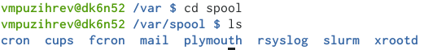

---
## Front matter
lang: ru-RU
title: Отчет по лабораторной работе №6
author: |
	Пузырев Владислав Максимович
institute: |
	\inst{1}RUDN University, Moscow, Russian Federation
date: NEC--2021, 14 Maя

## Formatting
toc: false
slide_level: 2
theme: metropolis
header-includes: 
 - \metroset{progressbar=frametitle,sectionpage=progressbar,numbering=fraction}
 - '\makeatletter'
 - '\beamer@ignorenonframefalse'
 - '\makeatother'
aspectratio: 43
section-titles: true
---

# Цель работы

Приобретение практических навыков взаимодействия пользователя с системойпосредством командной строки.

# Задание

1. Определите полное имя вашего домашнего каталога. Далее относительно этого каталога будут выполняться последующие упражнения.
2. Выполните следующие действия:
3. Перейдите в каталог/tmp.
4. Выведите на экран содержимое каталога/tmp. Для этого используйте команду ls с различными опциями. Поясните разницу в выводимой на экран информации.
5. Определите, есть ли в каталоге/var/spool подкаталог с именем cron?
6. Перейдите в Ваш домашний каталог и выведите на экран его содержимое.Определите, кто является владельцем файлов и подкаталогов?
7. Выполните следующие действия:В домашнем каталоге создайте новый каталог с именемnewdir.В каталоге~/newdirсоздайте новый каталог с именемmorefun.В домашнем каталоге создайте одной командой три новых каталога с име-намиletters,memos,misk. Затем удалите эти каталоги одной командой.Попробуйте удалить ранее созданный каталог~/newdirкомандойrm. Про-верьте, был ли каталог удалён.Удалите каталог~/newdir/morefunиз домашнего каталога. Проверьте,был ли каталог удалён.
8. С помощью команды man определите, какую опцию командыь ls нужно использовать для просмотра содержимое не только указанного каталога, но и подкаталогов, входящих в него.
9. С помощью команды man определите набор опций команды ls, позволяющий отсортировать по времени последнего изменения выводимый список содержимого каталога с развёрнутым описанием файлов.
10. Используйте командуmanдля просмотра описания следующих команд:cd,pwd,mkdir,rmdir,rm. Поясните основные опции этих команд.
11. Используя информацию, полученную при помощи команды history, выполните модификацию и исполнение нескольких команд из буфера команд.

# Выполнение лабораторной работы
##Слайд 1
- Определите полное имя вашего домашнего каталога. Далее относительно этого каталога будут выполняться последующие упражнения.Перешли в каталог tmp и вывели его содержимое 

{width=70% }
{width=70% }
{width=70% }

##Слайд 2
- Определите, есть ли в каталоге/var/spool подкаталог с именем cron?

{width=70% }
Перешли в католог /var/spool/  и убедились что там есть подкаталог cron.

##Слайд 3
- Выполните следующие действия:В домашнем каталоге создайте новый каталог с именем newdir.В каталоге~/newdir создайте новый каталог с именем morefun.В домашнем каталоге создайте одной командой три новых каталога с именами letters,memos,misk. Затем удалите эти каталоги одной командой.Попробуйте удалить ранее созданный каталог~/newdirкомандойrm. Про-верьте, был ли каталог удалён.Удалите каталог~/newdir/morefunиз домашнего каталога. Проверьте,был ли каталог удалён.
##Слайд 4
{width=70% }
Создал новый каталог и создал три новых в домашней папке с помощью одной команды. 

##Слайд 5
{width=70% }
Проверил что они создались и удалил каталог newdir.

##Слайд 6
- Использование команды man.

Посмотрел набор опций для команды ls, cd, pwd, mkdir, rmdir, rm.

- Используя информацию, полученную при помощи команды history, выполните модификацию и исполнение нескольких команд из буфера команд.
##Слайд 7
{width=70% }
Ввел команду history, появился буфер введеных мною команд

## Контрольные вопросы

1. Командная строка (консольили Терминал) –это специальная программа, которая позволяет управлять компьютером путем ввода текстовых команд с клавиатуры.
2. Для определения абсолютного пути к текущему каталогу исполь-зуется командаpwd(print working directory) Пример (абсолютное имя текущего каталога пользователя dharma): pwd результат:/afs/dk.sci.pfu.edu.ru/home/d/h/dharma
3. Основные опции: -name -поиск по имени, задается шаблон поиска; -user -поиск файлов принадлежащих конкретному пользователю; -group -поиск файлов принадлежащих конкретной группе; -perm -поиск файлов по режиму доступа; -type -поиск файлов по типу.
4. Некоторые файлы в операционной системе скрыты от просмотра и обычно используются для настройки рабочей среды. Имена таких файлов начинаются с точки. Для того, чтобы отобразить имена скрытых файлов, необходимо использовать команду ls с опцией a:ls -a
5. Команда rm используется для удаления файлов и/или каталогов.Чтобы удалить каталог, содержащий файлы, нужно использовать опцию r. Без указания этой опции команда не будет выполняться.Если каталог пуст, то можно воспользоваться командой rmdir. Если удаляемый каталог содержит файлы, то команда не будет выполнена —нужно использовать rm –r.
6. Для вывода на экран списка ранее выполненных команд используется команда history.
7. Выводимые на экран команды в списке нумеруются. К любой команде из выведенного на экран списка можно обратиться по её номеру в списке, воспользовавшись конструкцией!.Пример:history1 pwd2 ls3 ls -a 4 ls -l5 cd /6 history !5 cd /
Можно модифицировать команду из выведенного на экран списка при помощи следующей конструкции:!:s//
8. Использование символа «;».Если требуется выполнить последовательно несколько команд, записанный в одной строке, то для этого используется символ точка с запятойПример: cd; ls
9. Если в заданном контексте встречаются специальные символы (типа «.», «/», «*» и т.д.), надо перед ними поставить символ экранирования (обратный слэш).!3:s/ cd//F ls –FКогда мы использовали команду cd/ то перед / поставили .
10. Какая информация выводится на экран о файлах и каталогах, если используется опция l в команде ls?Чтобы вывести на экран подробную информацию о файлах и каталогах, необходимо использовать опцию l. При этом о каждом файле и каталоге будет выведена следующая информация:–тип файла,–право доступа,–число ссылок,–владелец,–размер,–дата последней ревизии,–имя файла или каталога.
11. Относительный путь —так же как и полный путь, строится перечислением через / всех каталогов, но начинается от текущего каталога (каталога, в котором «находится» пользователь), т.е. пользователь, находясь в каталоге user, может обратиться к файлу addition.txt, указав относительный путь documents/addition.txt.Таким образом, в Linux если имя объекта начинается с /, то системой это интерпретируется как полный
12. Команда man используется для просмотра (оперативная помощь) в диалоговом режиме руководства (manual) по основным командам операционной системы типа Linux. Формат команды: man 13.Автодополнение с помощью клавиши TabTab: автоматически завершает ввод имени файла, имени каталога или команды.

# Вывод

Приобрел практический навык взаимодействия с системой посредством командной строки.
