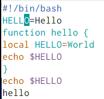
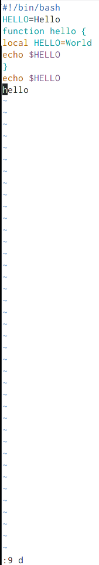

---
## Front matter
lang: ru-RU
title: Structural approach to the deep learning method
author: Пузырев Владислав Максимович
institute: |
	\inst{1}RUDN University, Moscow, Russian Federation

## Formatting
toc: false
slide_level: 2
theme: metropolis
header-includes: 
 - \metroset{progressbar=frametitle,sectionpage=progressbar,numbering=fraction}
 - '\makeatletter'
 - '\beamer@ignorenonframefalse'
 - '\makeatother'
aspectratio: 43
section-titles: true
---

# Цель работы

Познакомиться с операционной системой Linux, получить практические навыки работы с редактором vi, установленным по умолчанию практически во всех дистрибутивах.

# Задание

1. Ознакомился с теоретическим материалом.
2. Ознакомился с редактором vi.
3. Выполнил упражнения, используя команды vi.

# Ход работы

## Слайд 1

## Слайд 2

## Слайд 3

## Слайд 4

## Слайд 5

## Слайд 6

## Слайд 7

## Слайд 8

## Слайд 9

## Вывод
- Познакомилась с операционной системой Linux, получила практические навыки работы с редактором vi, установленным по умолчанию практически во всех дистрибутивах.

