---
# РОССИЙСКИЙ УНИВЕРСИТЕТ ДРУЖБЫ НАРОДОВ
## Факультет физико-математических и естественных наук

lang: ru-RU
title: "Отчёт по лабораторной работе №9"
author: "Пузырев Владислав Максимович"

# Formatting
toc-title: "Содержание"
toc: true # Table of contents
toc_depth: 2
lof: true # List of figures
lot: true # List of tables
fontsize: 12pt
linestretch: 1.5
papersize: a4paper
documentclass: scrreprt
polyglossia-lang: russian
polyglossia-otherlangs: english
mainfont: PT Serif
romanfont: PT Serif
sansfont: PT Sans
monofont: PT Mono
mainfontoptions: Ligatures=TeX
romanfontoptions: Ligatures=TeX
sansfontoptions: Ligatures=TeX,Scale=MatchLowercase
monofontoptions: Scale=MatchLowercase
indent: true
pdf-engine: lualatex
header-includes:
  - \linepenalty=10 # the penalty added to the badness of each line within a paragraph (no associated penalty node) Increasing the value makes tex try to have fewer lines in the paragraph.
  - \interlinepenalty=0 # value of the penalty (node) added after each line of a paragraph.
  - \hyphenpenalty=50 # the penalty for line breaking at an automatically inserted hyphen
  - \exhyphenpenalty=50 # the penalty for line breaking at an explicit hyphen
  - \binoppenalty=700 # the penalty for breaking a line at a binary operator
  - \relpenalty=500 # the penalty for breaking a line at a relation
  - \clubpenalty=150 # extra penalty for breaking after first line of a paragraph
  - \widowpenalty=150 # extra penalty for breaking before last line of a paragraph
  - \displaywidowpenalty=50 # extra penalty for breaking before last line before a display math
  - \brokenpenalty=100 # extra penalty for page breaking after a hyphenated line
  - \predisplaypenalty=10000 # penalty for breaking before a display
  - \postdisplaypenalty=0 # penalty for breaking after a display
  - \floatingpenalty = 20000 # penalty for splitting an insertion (can only be split footnote in standard LaTeX)
  - \raggedbottom # or \flushbottom
  - \usepackage{float} # keep figures where there are in the text
  - \floatplacement{figure}{H} # keep figures where there are in the text
---

# Formatting
toc-title: "Содержание"
toc: true # Table of contents
toc_depth: 2
lof: true # List of figures
lot: true # List of tables
fontsize: 12pt
linestretch: 1.5
papersize: a4paper
documentclass: scrreprt
polyglossia-lang: russian
polyglossia-otherlangs: english
mainfont: PT Serif
romanfont: PT Serif
sansfont: PT Sans
monofont: PT Mono
mainfontoptions: Ligatures=TeX
romanfontoptions: Ligatures=TeX
sansfontoptions: Ligatures=TeX,Scale=MatchLowercase
monofontoptions: Scale=MatchLowercase
indent: true
pdf-engine: lualatex
header-includes:
  - \linepenalty=10 # the penalty added to the badness of each line within a paragraph (no associated penalty node) Increasing the value makes tex try to have fewer lines in the paragraph.
  - \interlinepenalty=0 # value of the penalty (node) added after each line of a paragraph.
  - \hyphenpenalty=50 # the penalty for line breaking at an automatically inserted hyphen
  - \exhyphenpenalty=50 # the penalty for line breaking at an explicit hyphen
  - \binoppenalty=700 # the penalty for breaking a line at a binary operator
  - \relpenalty=500 # the penalty for breaking a line at a relation
  - \clubpenalty=150 # extra penalty for breaking after first line of a paragraph
  - \widowpenalty=150 # extra penalty for breaking before last line of a paragraph
  - \displaywidowpenalty=50 # extra penalty for breaking before last line before a display math
  - \brokenpenalty=100 # extra penalty for page breaking after a hyphenated line
  - \predisplaypenalty=10000 # penalty for breaking before a display
  - \postdisplaypenalty=0 # penalty for breaking after a display
  - \floatingpenalty = 20000 # penalty for splitting an insertion (can only be split footnote in standard LaTeX)
  - \raggedbottom # or \flushbottom
  - \usepackage{float} # keep figures where there are in the text
  - \floatplacement{figure}{H} # keep figures where there are in the text
---

# Цель работы

Познакомиться с операционной системой Linux. Получить практические навыки работы с редактором Emacs.

# Задание

1.Ознакомиться с теоретическим материалом.
2.Ознакомиться с редактором emacs.
3.Выполнить упражнения.
4.Ответить на контрольные вопросы.

# Выполнение лабораторной работы


1. Открыл emacs.
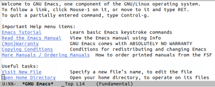

2. Создал файл work.sh с помощью комбинации Ctrl-x Ctrl-f (C-x C-f).

3. Наберите текст:
```bash
#!/bin/bash
HELL=Hello
function hello
{
LOCAL HELLO=World 
echo $HELLO
}
echo $HELLO
hello
```

 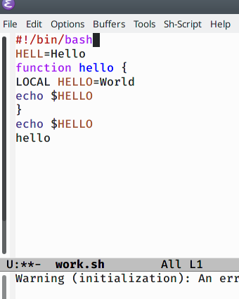

4. Сохранил файл с помощью комбинации Ctrl-x Ctrl-s (C-x C-s).

5. Проделал с текстом стандартные процедуры редактирования, каждое действие должно осуществляться комбинацией клавиш.
 
 - 5.1. Вырезать одной командой целую строку (С-k).

 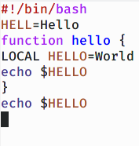

 -  5.2. Вставил эту строку в конец файла (C-y).

 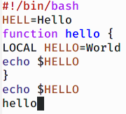

  - 5.3. Выделил область текста (C-space).

 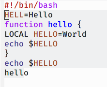

  - 5.4. Скопировал область в буфер обмена (M-w).
  - 5.5. Вставил область в конец файла.

  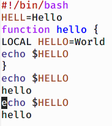

  - 5.6. Вновь выделил эту область и на этот раз вырезал её (C-w).
  - 5.7. Отменил последнее действие (C-/).

 

6. Научился использовать команды по перемещению курсора.
  - 6.1. Переместил курсор в начало строки (C-a).
  - 6.2. Переместил курсор в конец строки (C-e).
  - 6.3. Переместил курсор в начало буфера (M-<).
 -  6.4. Переместил курсор в конец буфера (M->).

7. Управление буферами.
 7.1. Вывел список активных буферов на экран (C-x C-b).


 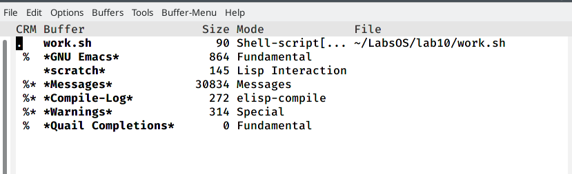

 7.2. Переместился во вновь открытое окно (C-x) o со списком открытых буферов и переключился на другой буфер.


 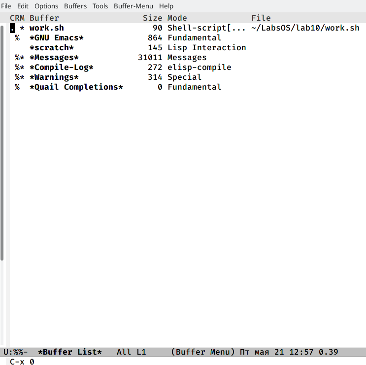

 7.3. Закрыл это окно (C-x 0).

 7.4. Теперь вновь переключился между буферами, но уже без вывода их спискана экран (C-x b)
 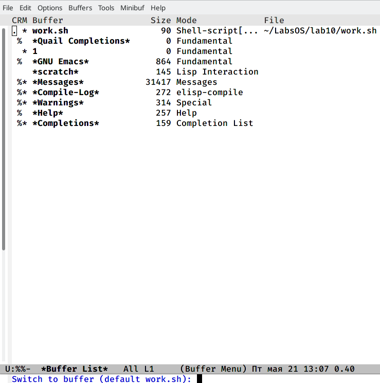

8. Управление окнами.
 8.1. Поделил фрейм на 4 части: разделила фрейм на два окна по вертикали(C-x 3), а затем каждое из этих окон на две части по горизонтали (C-x 2)
 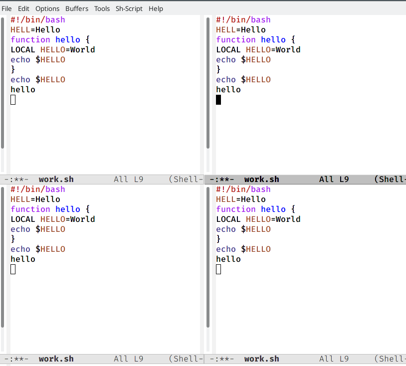


 8.2. В каждом из четырёх созданных окон открыла новый буфер (файл) и ввёл несколько строк текста.


9. Режим поиска
 9.1. Переключился в режим поиска(C-s) и нашла несколько слов, присутствующих в тексте.
 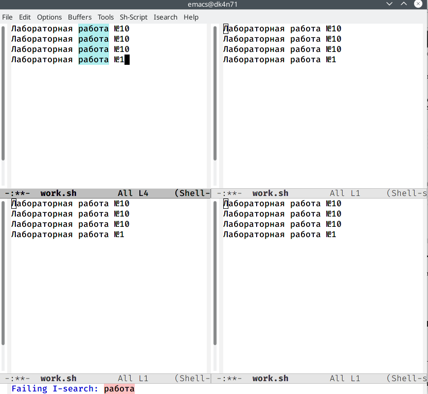

 9.2. Переключался между результатами поиска, нажимая C-s.

 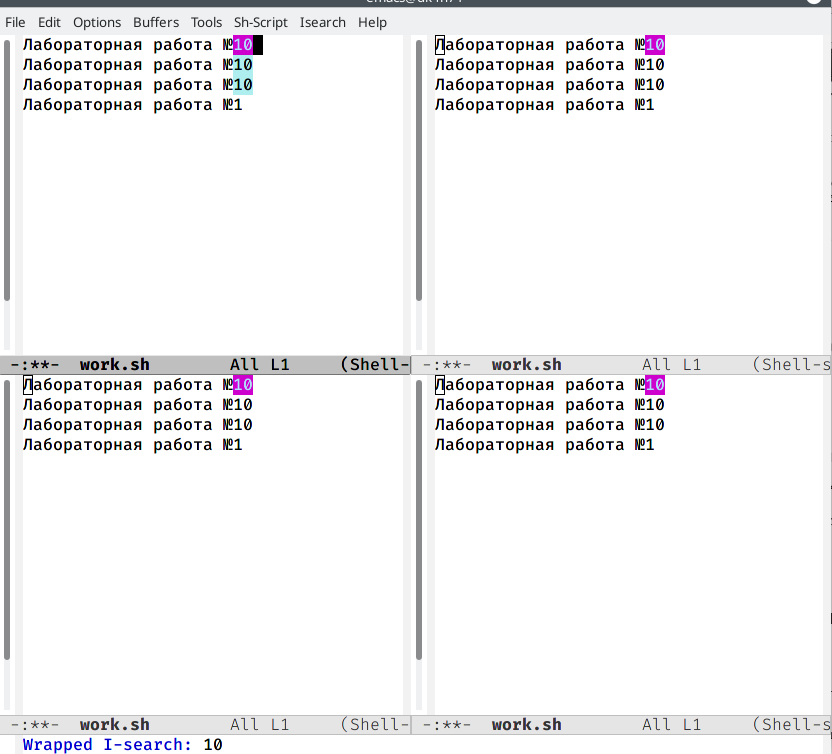

 9.3. Вышел из режима поиска, нажав C-g.

 9.4. Перешёл в режим поиска и замены (M-%), ввёл текст, который следовало найти и заменить, нажала Enter, затем ввела текст для замены. После того как будут подсвечены результаты поиска, нажал ! для подтверждения замены.


 9.5. Испробовал другой режим поиска, нажав M-s o. Объясните, чем он отличается от обычного режима?
 В отличие от другого типа поиска этот ищет первое попавшееся элемент, который удовлетворяет параметру поиска.

 Слайд не отобразился


# Выводы

Я познакомился с операционной системой Linux и получила практические навыки работы с редактором emacs, установленным по умолчанию практически во всех дистрибутивах.