---
## Front matter
lang: ru-RU
title: Отчет по лабораторной работе №10
author: |
	Пузырев Владислав Максимович
institute: |
	\inst{1}RUDN University, Moscow, Russian Federation

## Formatting
toc: false
slide_level: 2
theme: metropolis
header-includes: 
 - \metroset{progressbar=frametitle,sectionpage=progressbar,numbering=fraction}
 - '\makeatletter'
 - '\beamer@ignorenonframefalse'
 - '\makeatother'
aspectratio: 43
section-titles: true
---

# Цель работы

Познакомиться с операционной системой Linux. Получить практические навыки работы с редактором Emacs.

# Задание

1. Ознакомиться с теоретическим материалом.
2. Ознакомиться с редактором emacs.
3. Выполнить упражнения.
4. Ответить на контрольные вопросы.

# Выполнение лабораторной работы
## Слайд 1
   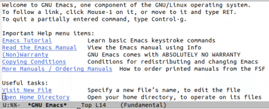
  
## Слайд 2
  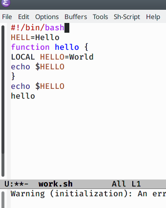

## Слайд 3
  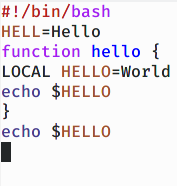
  
## Слайд 4
  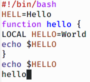
  
## Слайд 5
  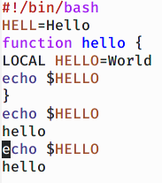
  
## Слайд 6
  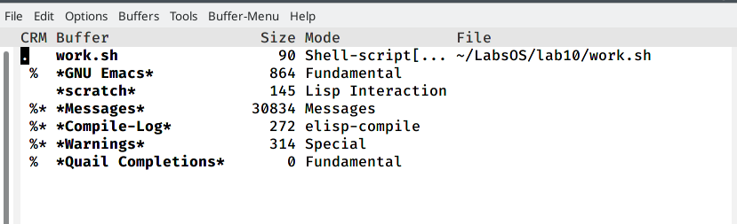
  
## Слайд 7
  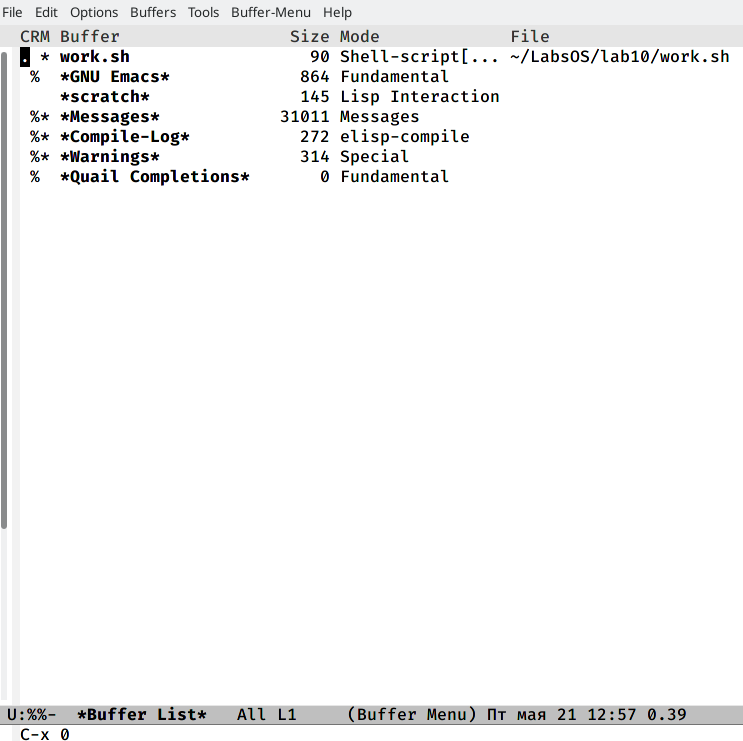
  
## Слайд 8
  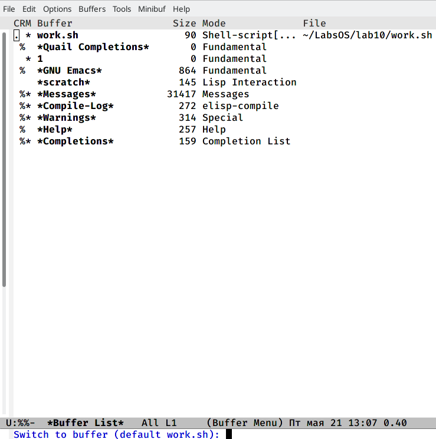
  
## Слайд 9
  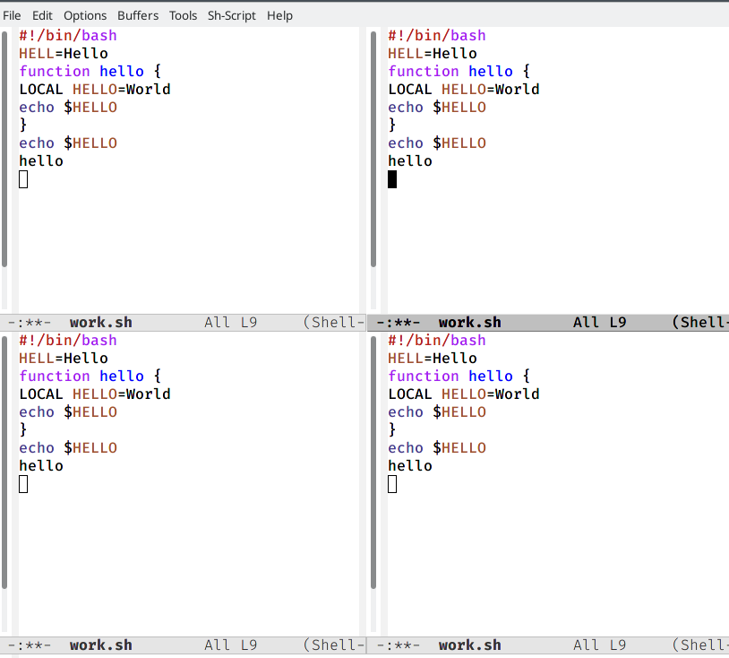

## Слайд 10
  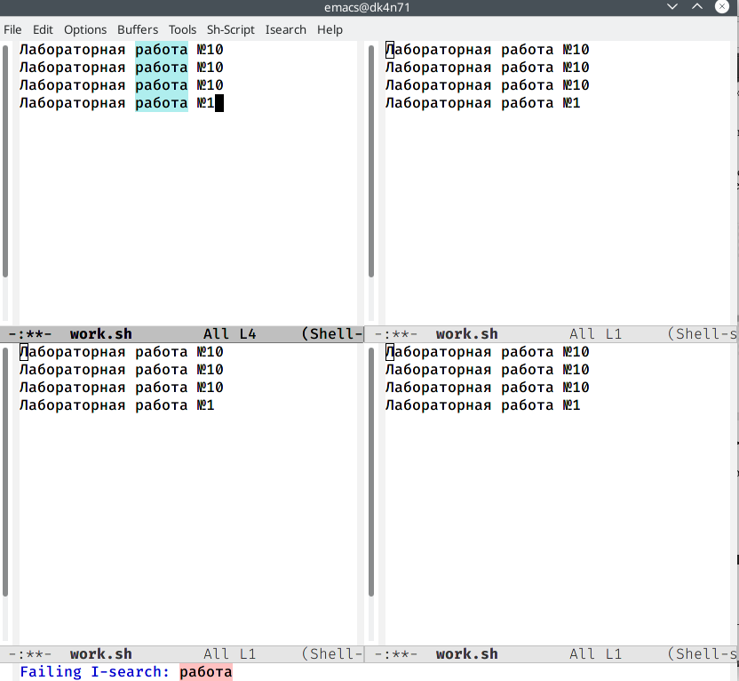

## Слайд 11
  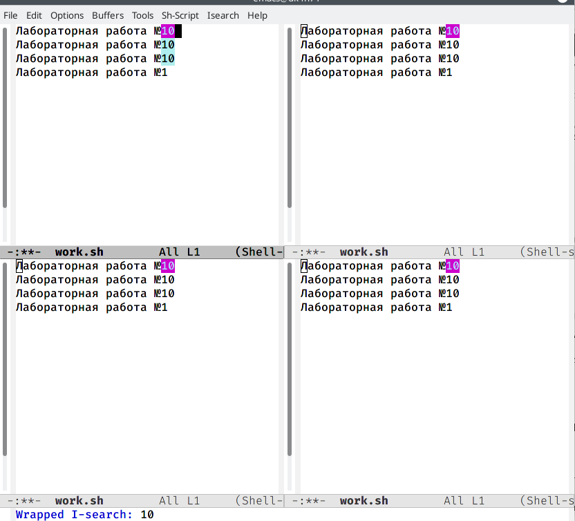
  
## Слайд 12
  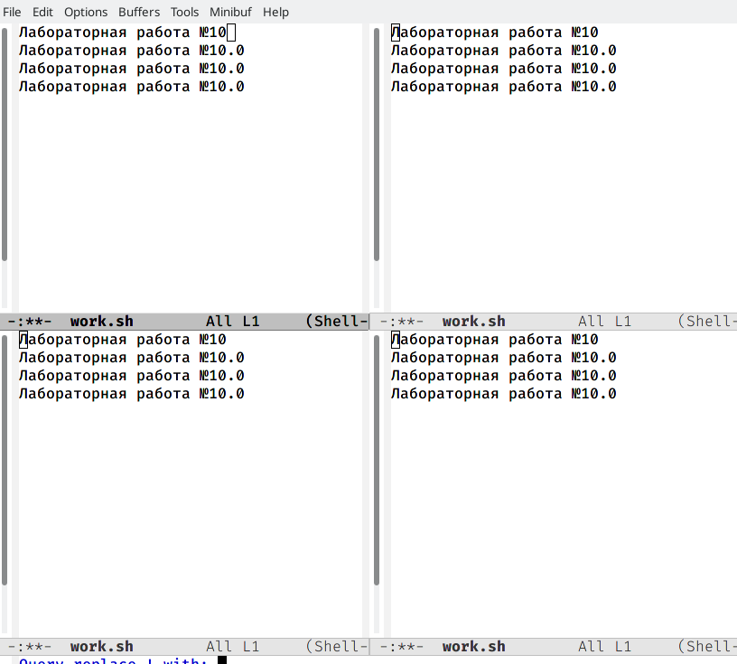
  
## Слайд 13
  В отличие от другого типа поиска этот ищет первое попавшееся элемент, который удовлетворяет параметру поиска.