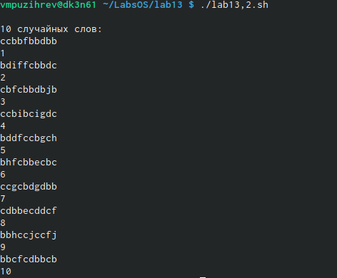

---
## Front matter
lang: ru-RU
title: Structural approach to the deep learning method
author: Пузырев Владислав Максимович
institute: |
	Россия, Москва
date: 03.06.2021

## Formatting
toc: false
slide_level: 2
theme: metropolis
header-includes: 
 - \metroset{progressbar=frametitle,sectionpage=progressbar,numbering=fraction}
 - '\makeatletter'
 - '\beamer@ignorenonframefalse'
 - '\makeatother'
aspectratio: 43
section-titles: true
---

# Ход работы

## Слайд 1

	Написать командный файл, реализующий упрощённый механизм семафоров. Ко-мандный файл должен в течение некоторого времениt1дожидаться освобожде-ния ресурса, выдавая об этом сообщение, а дождавшись его освобождения, ис-пользовать его в течение некоторого времениt2<>t1, также выдавая информа-цию о том, что ресурс используется соответствующим командным файлом (про-цессом). Запустить командный файл в одном виртуальном терминале в фоновомрежиме, перенаправив его вывод в другой (> /dev/tty#, где#— номер тер-минала куда перенаправляется вывод), в котором также запущен этот файл, ноне фоновом, а в привилегированном режиме. Доработать программу так, чтобыимелась возможность взаимодействия трёх и более процессов.

## Слайд 2

## Слайд 3

## Слайд 4

## Слайд 5
	Реализовать командуmanс помощью командного файла. Изучите содержимоекаталога/usr/share/man/man1. В нем находятся архивы текстовых файлов,содержащих справку по большинству установленных в системе программ и ко-манд. Каждый архив можно открыть командойlessсразу же просмотрев содер-жимое справки. Командный файл должен получать в виде аргумента команднойстроки название команды и в виде результата выдавать справку об этой коман-де или сообщение об отсутствии справки, если соответствующего файла нет вкаталогеman1.

## Слайд 6

## Слайд 7

## Слайд 8
	Используя встроенную переменную$RANDOM, напишите командный файл, гене-рирующий случайную последовательность букв латинского алфавита. Учтите,что$RANDOMвыдаёт псевдослучайные числа в диапазоне от 0 до 32767.

## Слайд 9

## Вывод

Изучил основы программирования в оболочке ОС UNIX, научился писать более сложные командные файлы с использованием логических управляющих конструкций и циклов.
