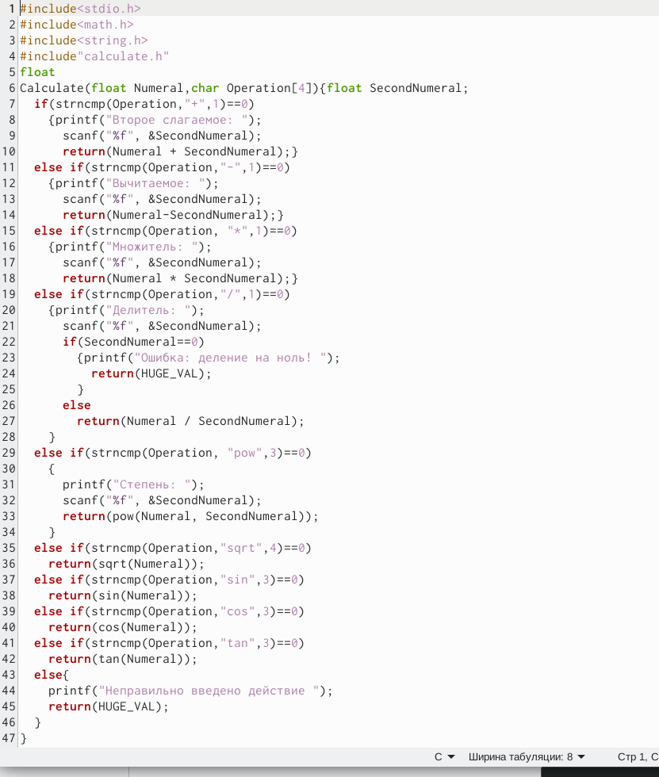
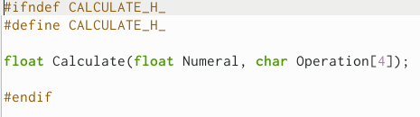
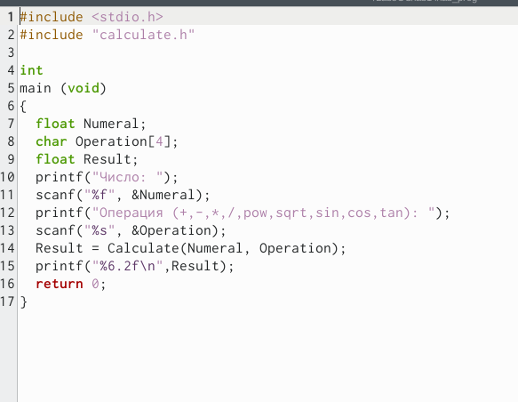
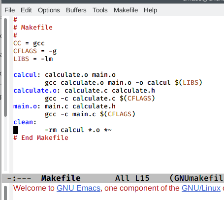
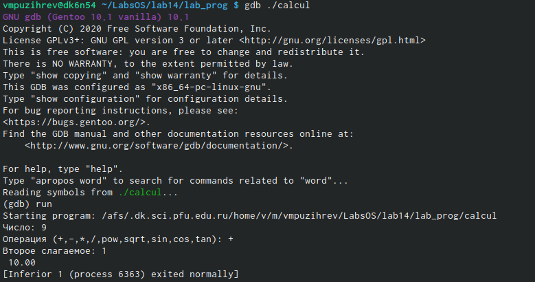
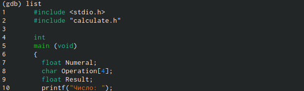
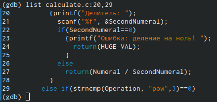
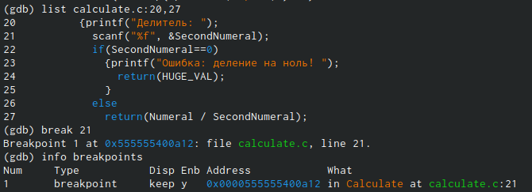
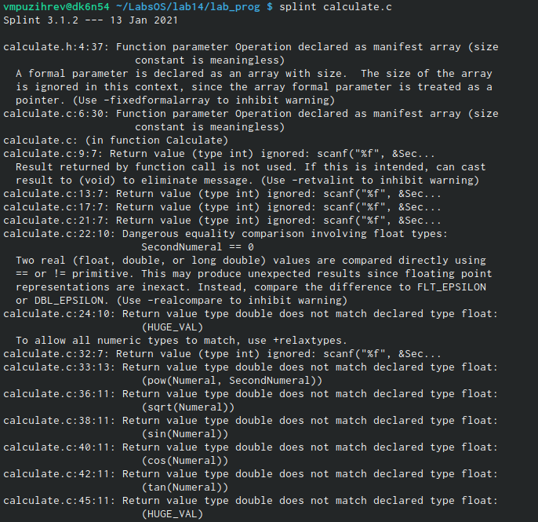
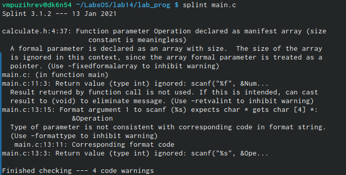

---
## Front matter
lang: ru-RU
title: Отчет по лабораторной работе №14
author: |
	Пузырев Владислав Максимович
institute: |
	Россия, Москва
date: 04.06.2021

## Formatting
toc: false
slide_level: 2
theme: metropolis
header-includes: 
 - \metroset{progressbar=frametitle,sectionpage=progressbar,numbering=fraction}
 - '\makeatletter'
 - '\beamer@ignorenonframefalse'
 - '\makeatother'
aspectratio: 43
section-titles: true
---

# Цель работы

Приобрести простейшие навыки разработки, анализа, тестирования и отладки приложений в ОС типа UNIX/Linux на примере создания на языке программирования С калькулятора с простейшими функциями.

# Задание
**Выполнить следующие пункты:**

1. В домашнем каталоге создайте подкаталог~/Lab_OS/lab14/lab_prog.
2. Создайте в нём файлы:calculate.h,calculate.c,main.c.
3. Выполните компиляцию программы посредством gcc:
> gcc -c calculate.c
> gcc -c main.c 
> gcc calculate.o main.o -o calcul -lm
4. Создайте Makefile со следующим содержанием.
5. С помощью gdb выполните отладку программы calcul (перед использованием gdb исправьте Makefile)
6. С помощью утилиты splint попробуйте проанализировать коды файлов calculate.c и main.c.

# Выполнение лабораторной работы
Перед выполнением лабораторной работы я хорошо ознакомился с теоритическим материалом для её выполнения

## Слайд 1

## Слайд 2

## Слайд 3

## Слайд 4
 

## Слайд 5

## Слайд 6

## Слайд 7

## Слайд 8

## Слайд 9

## Слайд 10

## Слайд 11

