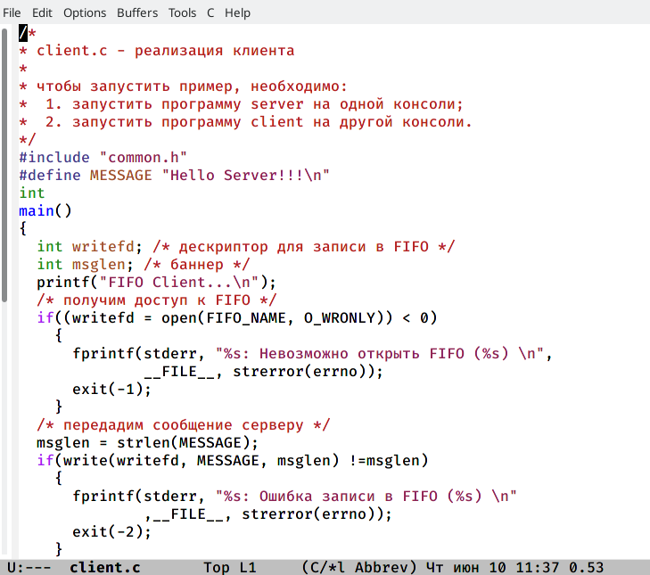

---
## Front matter
lang: ru-RU
title: Отчёт по лабораторной работе №15
author: Пузырев Владислав Максимович
institute: |
	\inst{1}RUDN University, Moscow, Russian Federation
	
date: 10.06.2021

## Formatting
toc: false
slide_level: 2
theme: metropolis
header-includes: 
 - \metroset{progressbar=frametitle,sectionpage=progressbar,numbering=fraction}
 - '\makeatletter'
 - '\beamer@ignorenonframefalse'
 - '\makeatother'
aspectratio: 43
section-titles: true
---

# Цель работы

- Приобретение практических навыков работы с именованными каналами.

# Ход работы

## Слайд 1

## Слайд 2

## Слайд 3

## Слайд 4

## Слайд 4.2

## Слайд 5

Вывод: приобрёл практические навыки работы с именованными каналам.
