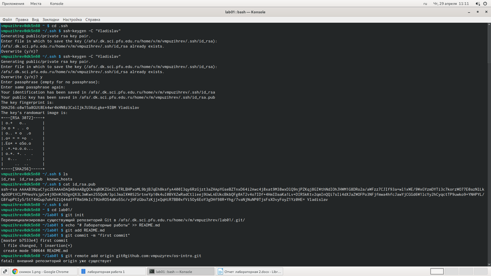
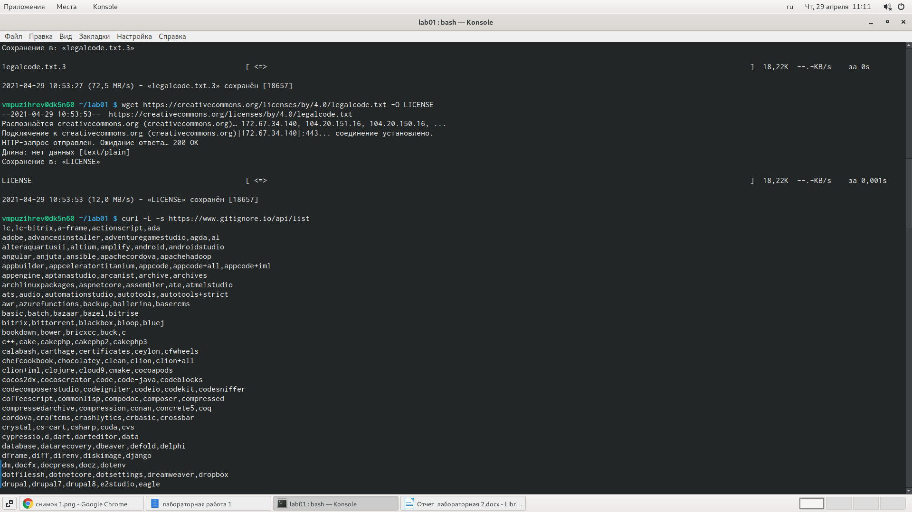
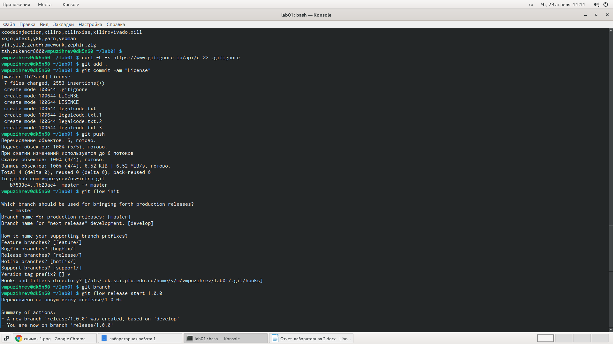
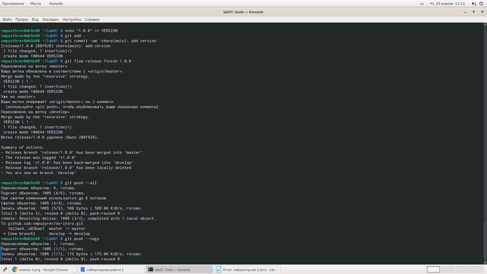

---
# Front matter
lang: ru-RU
title: "Лабораторная работа №2"
subtitle: "Простейший вариант"
author: "Пузырев Владислав Максимович"

# Formatting
lof: true # List of figures
lot: true # List of tables
fontsize: 12pt
linestretch: 1.5
papersize: a4paper
documentclass: scrreprt
polyglossia-lang: russian
polyglossia-otherlangs: english
mainfont: PT Serif
romanfont: PT Serif
sansfont: PT Sans
monofont: PT Mono
mainfontoptions: Ligatures=TeX
romanfontoptions: Ligatures=TeX
sansfontoptions: Ligatures=TeX,Scale=MatchLowercase
monofontoptions: Scale=MatchLowercase
indent: true
pdf-engine: lualatex
header-includes:
  - \linepenalty=10 # the penalty added to the badness of each line within a paragraph (no associated penalty node) Increasing the value makes tex try to have fewer lines in the paragraph.
  - \interlinepenalty=0 # value of the penalty (node) added after each line of a paragraph.
  - \hyphenpenalty=50 # the penalty for line breaking at an automatically inserted hyphen
  - \exhyphenpenalty=50 # the penalty for line breaking at an explicit hyphen
  - \binoppenalty=700 # the penalty for breaking a line at a binary operator
  - \relpenalty=500 # the penalty for breaking a line at a relation
  - \clubpenalty=150 # extra penalty for breaking after first line of a paragraph
  - \widowpenalty=150 # extra penalty for breaking before last line of a paragraph
  - \displaywidowpenalty=50 # extra penalty for breaking before last line before a display math
  - \brokenpenalty=100 # extra penalty for page breaking after a hyphenated line
  - \predisplaypenalty=10000 # penalty for breaking before a display
  - \postdisplaypenalty=0 # penalty for breaking after a display
  - \floatingpenalty = 20000 # penalty for splitting an insertion (can only be split footnote in standard LaTeX)
  - \raggedbottom # or \flushbottom
  - \usepackage{float} # keep figures where there are in the text
  - \floatplacement{figure}{H} # keep figures where there are in the text
---

# Цель работы

**Изучить идеологию и применение средств контроля версий, изучть работу с репозитариями и сайтом   Github**

# Задание

1. *Настройка git*
  - Создайте учётную запись на https://github.com.
  - Настройте систему контроля версий git, как это описано выше c использованием сервера репозиториев 
  - Создайте структуру каталога лабораторных работ согласно пункту М.2
2. *Подключение репозитория к github*
- Создайте репозиторий на GitHub. Для примера назовём егоos-intro.
- Рабочий каталог будем обозначать как laboratory. Вначале нужно перейти в этот каталог: cd laboratory
- Инициализируем системы git:git init
- Создаём заготовку для файла README.md: echo"# Лабораторные работы">> README.md
- Делаем первый коммит и выкладываем на github:

3. *Первичная конфигурация*
- Добавим файл лицензии:wget  LICENSE
- Добавим шаблон игнорируемых файлов. Просмотрим список имеющихся шаблонов:curl -L -s Затем скачаем шаблон,например,для C:curl -L -s  >> .gitignore Можно это же сделать через web-интерфейс на сайте
- Выполним коммит
- Отправим на github:
4. *Конфигурация git-flow*
- Инициализируем git-flowgit flow init
Префикс для ярлыков установим вv.
- Проверьте,что Вы на веткеdevelop:git branch
- Создадим релиз с версией 1.0.0
- Запишем версию:echo"1.0.0">> VERSION
- Добавим в индекс:git add .git commit -am'chore(main): add version'
- Зальём релизную ветку в основную веткуgit flow release finish1.0.0
- Отправим данные на githubgit push --allgit push —tags
- Создадим релиз на github.

# Выполнение лабораторной работы

- Создаём репозиторий os-intro на GitHub.

- Рабочий каталог будем обозначать как lab01. Вначале нужно перейти в этот каталог: cd lab01

- Инициализируем системы git:git init

- Создаём заготовку для файла README.md: echo"# Лабораторные работы">> README.md

- Делаем первый коммит и выкладываем на github:

{ #fig:001 width=70% }

3. **Первичная конфигурация**
  
  - Добавим файл лицензии:wget  LICENSE
  
  - Добавим шаблон игнорируемых файлов. Просмотрим список имеющихся шаблонов:'curl -L -s' Затем скачаем шаблон,например,для 'C:curl -L -s'  >> .gitignore Можно это же сделать через web-интерфейс на сайте
  
  - Добавим новые файлы
  
  - Выполним коммит
  
  - Отправим на github: 

2.5.4.**Конфигурация git-flow**

  - Инициализируем git-flowgit flow init

  { #fig:001 width=70% }

**Префикс для ярлыков установим вv.**

- Проверил,что Вы на веткеdevelop:git branch
 
  { #fig:001 width=70% }

 **Создадим релиз с версией 1.0.0**
 
 **Запишем версию:echo"1.0.0">> VERSION**
 
 **Добавим в индекс:git add .git commit -am'chore(main): add version'**
 
 **Зальём релизную ветку в основную веткуgit flow release finish1.0.0**
 
 **Отправим данные на githubgit push --allgit push —tags**

 **Создадим релиз на github.**

 { #fig:001 width=70% }

{ #fig:001 width=70% }

{ #fig:001 width=70% }
# Выводы

**Я изучили как работать с репозитариями и Github.**
