---
# Front matter
lang: ru-RU
title: "отчет по лабе 6"
author: "Пузырев Владислав Максимович"

# Formatting
toc-title: "Содержание"
toc: true # Table of contents
toc_depth: 2
lof: true # List of figures
lot: true # List of tables
fontsize: 12pt
linestretch: 1.5
papersize: a4paper
documentclass: scrreprt
polyglossia-lang: russian
polyglossia-otherlangs: english
mainfont: PT Serif
romanfont: PT Serif
sansfont: PT Sans
monofont: PT Mono
mainfontoptions: Ligatures=TeX
romanfontoptions: Ligatures=TeX
sansfontoptions: Ligatures=TeX,Scale=MatchLowercase
monofontoptions: Scale=MatchLowercase
indent: true
pdf-engine: lualatex
header-includes:
  - \linepenalty=10 # the penalty added to the badness of each line within a paragraph (no associated penalty node) Increasing the value makes tex try to have fewer lines in the paragraph.
  - \interlinepenalty=0 # value of the penalty (node) added after each line of a paragraph.
  - \hyphenpenalty=50 # the penalty for line breaking at an automatically inserted hyphen
  - \exhyphenpenalty=50 # the penalty for line breaking at an explicit hyphen
  - \binoppenalty=700 # the penalty for breaking a line at a binary operator
  - \relpenalty=500 # the penalty for breaking a line at a relation
  - \clubpenalty=150 # extra penalty for breaking after first line of a paragraph
  - \widowpenalty=150 # extra penalty for breaking before last line of a paragraph
  - \displaywidowpenalty=50 # extra penalty for breaking before last line before a display math
  - \brokenpenalty=100 # extra penalty for page breaking after a hyphenated line
  - \predisplaypenalty=10000 # penalty for breaking before a display
  - \postdisplaypenalty=0 # penalty for breaking after a display
  - \floatingpenalty = 20000 # penalty for splitting an insertion (can only be split footnote in standard LaTeX)
  - \raggedbottom # or \flushbottom
  - \usepackage{float} # keep figures where there are in the text
  - \floatplacement{figure}{H} # keep figures where there are in the text
---

# Цель работы

Ознакомление с файловой системой Linux, её структурой, именами и содержанием каталогов. Приобретение практических навыков по применению команд дляработы с файлами и каталогами, по управлению процессами (и работами), по про-верке использования диска и обслуживанию файловой системы.


# Задание

1.Выполните все примеры, приведённые в первой части описания лабораторной работы.

2.Выполните следующие действия, зафиксировав в отчёте по лабораторной работеиспользуемые при этом команды и результаты их выполнения:

2.1.Скопируйте файл/usr/include/sys/io.hв домашний каталог и назовитеегоequipment. Если файлаio.hнет, то используйте любой другой файл вкаталоге/usr/include/sys/вместо него.

2.2.В домашнем каталоге создайте директорию~/ski.plases.

2.3.Переместите файлequipmentв каталог~/ski.plases.

2.4.Переименуйтефайл~/ski.plases/equipmentв~/ski.plases/equiplist.

2.5.Создайте в домашнем каталоге файлabc1и скопируйте его в каталог~/ski.plases, 
назовите егоequiplist2.

2.6.Создайте каталог с именемe quipmentв каталоге~/ski.plases.

2.7.Переместите файлы~/ski.plases/equiplistиequiplist2в каталог~/ski.plases/equipment.

2.8.Создайте и переместите каталог~/newdirв каталог~/ski.plasesи назовите его plans.

3.Определите опции командыchmod, необходимые для того, чтобы присвоить пе-речисленным ниже файлам выделенные права доступа, считая, что в начале та-ких прав нет:

3.1.drwxr--r--   ...   australia

3.2.drwx--x--x   ...   play

3.3.-r-xr--r--   ...   my_os

3.4.-rw-rw-r--   ...   feathers

При необходимости создайте нужные файлы.

4.Проделайте приведённые ниже упражнения, записывая в отчёт по лабораторнойработе используемые при этом команды:

4.1.Просмотрите содержимое файла/etc/password.

4.2.Скопируйте файл~/feathersв файл~/file.old.

4.3.Переместите файл~/file.oldв каталог~/play.

4.4.Скопируйте каталог~/playв каталог~/fun.

4.5.Переместите каталог~/funв каталог~/playи назовите егоgames.

4.6.Лишите владельца файла~/feathersправа на чтение.

4.7.Что произойдёт, если вы попытаетесь просмотреть файл~/feathersко-мандойcat?

4.8.Что произойдёт, если вы попытаетесь скопировать файл~/feathers?

4.9.Дайте владельцу файла~/feathersправо на чтение.

4.10.Лишите владельца каталога~/playправа на выполнение.

4.11.Перейдите в каталог~/play. Что произошло?

4.12.Дайте владельцу каталога~/playправо на выполнение.

5.Прочитайтеmanпо командамmount,fsck,mkfs,kill и кратко их охарактери-зуйте, приведя примеры.

# Выполнение лабораторной работы


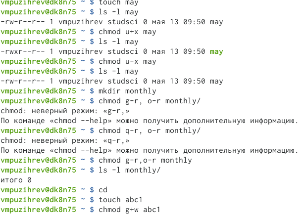
1. **Выполнил все примеры, приведённые в первой части описания лабораторной работы.**
2. **Выполнил следующие действия:**
    
    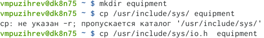
    - Скопировал файл/usr/include/sys/io.h в домашний каталог и назовал его equipment
    
    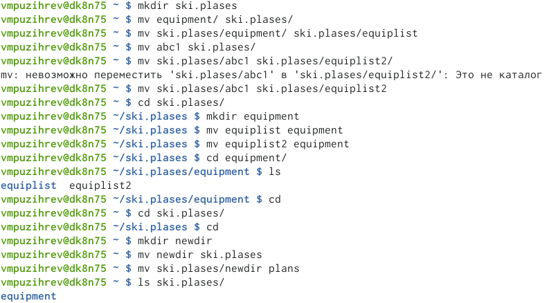
    - Выполнил последующие подпунты до 3 пунткта
    
3.  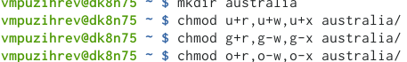
    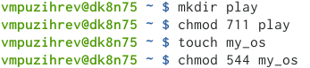
    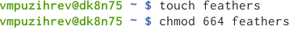
    
**Далее потребовалось создать файлы и передать права основываясь на этом**           
```bash
        drwxr--r--   ...   australia
        drwx--x--x   ...   play
        -r-xr--r--   ...   my_os
        -rw-rw-r--   ...   feather
```
4. 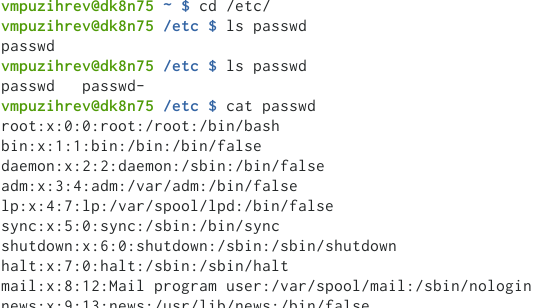 
   - Посмотрел содержимое файла passwd 
   - Создал каталог с название Лаба6 для работы с этой ЛР, в который переместил все файлы с этой ЛР
   
   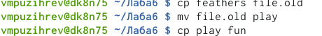
   - Выполнил пункты 4.2-4.4
   
   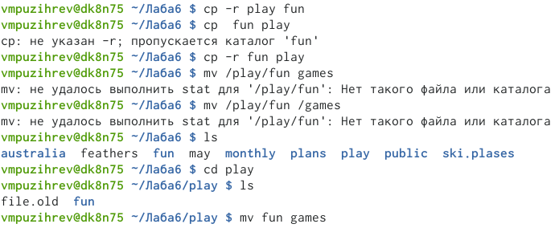
   - Переместил каталог~/fun в каталог~/play и назовал его games
   - Менял права каталога файла feathers
        
        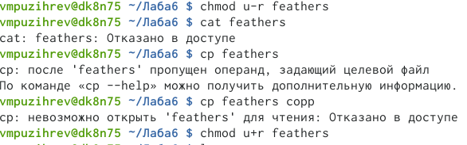
        - Лешив права на чтение, было отказано в открытии и копировании
   
   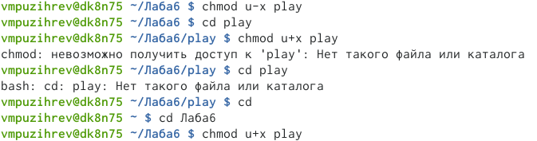
   - Меняя права доступа к каталогу play разницы заметно не было так как при наличии и отсутсвтии прав каталог открывался 
5. Применяя команду man мне предоставлялась возможность узнать синтаксис команды
   - Команда mount используется для подключения (монтирования) файловых систем и переносных накопителей (например, USB-флешек) к конкретным точкам монтирования в дереве директорий.
   - Команда fsck спользуется для проверки и исправления файловых систем.
   - Команд mkfs, используемая для форматирования блочного устройства хранения с определенной файловой системой.
   - Команда kill этот сигнал запрашивает остановку работы процесса.

# Ответы на контрольные вопросы 
1. Характеристика файловой системы, которая использовалась в данной лабораторной работе: Файлы: abc1, april, may, june, july, isdv4.h, equipment, equiplist, equiplist2, my_os, feathers, file.old. Каталоги: monthly, monthly.00, tmp, monthly.01, reports, usr, include, xorg, ski.plases, equipment, newdir, plans, australia, play, etc, fun, games.

2. Пример общей структуры файловой системы: /home/adkekisheva/monthly/april, где /home/adkekisheva – домашний каталог, /monthly – каталог, находящийся в домашнем и содержащий файл, /аpril – файл, находящийся в каталоге.

3. Чтобы содержимое некоторой файловой системы было доступно операционной системе должно быть выполнено монтирование тома.

4. Основные причины нарушения целостности файловой системы: - Один блок адресуется несколькими mode (принадлежит нескольким файлам). - Блок помечен как свободный, но в то же время занят (на него ссылается onode). - Блок помечен как занятый, но в то же время свободен (ни один inode на него не ссылается). - Неправильное число ссылок в inode (недостаток или избыток ссылающихся записей в каталогах). - Несовпадение между размером файла и суммарным размером адресуемых inode блоков. - Недопустимые адресуемые блоки (например, расположенные за пределами файловой системы). - "Потерянные" файлы (правильные inode, на которые не ссылаются записи каталогов). - Недопустимые или неразмещенные номера inode в записях каталогов. Чтобы устранить повреждения файловой системы используется команда fsck.

5. Команда mkfs создаёт новую файловую систему. Например, создать файловую систему linux, семейства ext, на устройстве можно с помощью команды mkfs. Ее синтаксис выглядит следующим образом: sudo mkfs -t тип устройство.

6. Для просмотра небольших файлов применяется команда cat. Для просмотра больших файлов используют команду less — она позволяет осуществлять постраничный просмотр файлов (длина страницы соответствует размеру экрана). Для просмотра начала файла существует командой head (по умолчанию она выводит первые 10 строк файла). Формат команды: head [-n] имя-файла, где n — количество выводимых строк. А команда tail выводит несколько (по умолчанию 10) последних строк файла. Формат команды: tail [-n] имя-файла, где n — количество выводимых строк.

7. Основные возможности команды cp: - копирование файла в текущем каталоге. - копирование нескольких файлов в каталог. - копирование файлов в произвольном каталоге.

сp- команда копирования файлов и каталогов. Формат команды: cp [-опции] исходный_файл целевой_файл Например, нам необходимо скопировать файл abc1, находящийся в домашней папке в файл abc2 для этого: cp abc1 abc2.

8. mv - перемещение (переименование) файлов. Она перемещает (переименовывает) файл1 в целевой_файл. Файл1 не должен совпадать с целевым_файлом. Если целевой файл является каталогом, то файл1, файл2, ..., перемещаются в него под своими именами.

mvdir перемещает каталоги в пределах файловой системы. Если целевой_каталог не существует, он создается; в противном случае создается каталог с именем целевой_каталог/исходный_каталог. Исходный и целевой каталоги не могут лежать на одном маршруте, то есть ни один из них не может быть прямым или косвенным подкаталогом другого.

9. Каждый файл и каждая папка имеют три уровня доступа: право на чтение (обозначается буквой r), право на запись (т. е. редактирование и удаление файла; w) и право на исполнение (запуск) скрипта (x).

Права доступа к файлу или каталогу можно изменить, воспользовавшись командой chmod. Сделать это может владелец файла (или каталога) или пользователь с правами администратора. Формат команды: chmod режим имя_файла


# Выводы

Ознакомлился с файловой системой Linux, её структурой, именами и содержа-нием каталогов. Приобрёл практических навыков по применению команд дляработы с файлами и каталогами, по управлению процессами (и работами), по про-верке использования диска и обслуживанию файловой системы.
