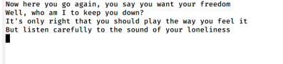
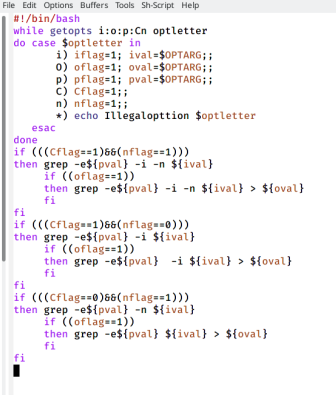
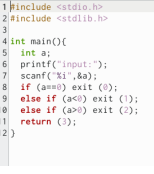
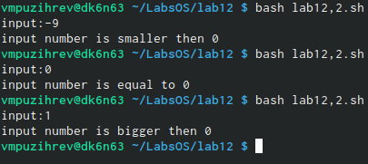
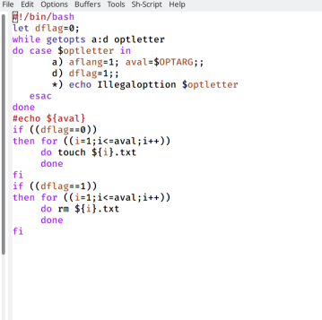
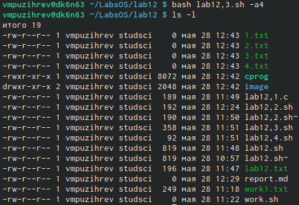
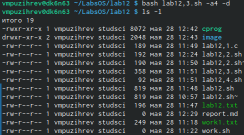
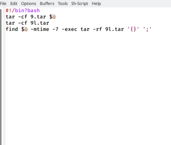
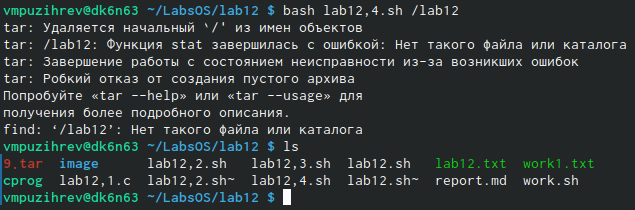

---
# Front matter
lang: ru-RU
title: "Презентация по лабораторной работе"
author: "Пузырев Владислав"
institute: \inst{1}RUDN University, Moscow, Russian Federation
	
date: 28.05.2021

## Formatting
toc: false
slide_level: 2
theme: metropolis
header-includes: 
 - \metroset{progressbar=frametitle,sectionpage=progressbar,numbering=fraction}
 - '\makeatletter'
 - '\beamer@ignorenonframefalse'
 - '\makeatother'
aspectratio: 43
section-titles: true
---

# Цель работы

Изучить основы программирования в оболочке ОС UNIX, научиться писать более сложные командные файлы с использованием логических управляющих конструкций и циклов. 

# Выполнение лабораторной работы

1. Используя команды getopts grep, написала командный файл, который анализирует командную строку с ключами:

– -iinputfile — прочитать данные из указанного файла;
– -ooutputfile — вывести данные в указанный файл;
– -pшаблон — указать шаблон для поиска;
– -C — различать большие и малые буквы;
– -n — выдавать номера строк.
а затем ищет в указанном файле нужные строки, определяемые ключом -p. 

## Слайд 1

 

## Слайд 2
 

## Слайд 3
2. Написал на языке Си программу, которая вводит число и определяет, является ли оно больше нуля, меньше нуля или равно нулю. Затем программа завершается с помощью функции exit(n), передавая информацию в о коде завершения в оболочку. Командный файл должен вызывать эту программу и, проанализировав с помощью команды $?, выдать сообщение о том, какое число было введено.

## Слайд 4
 

## Слайд 5
 

## Слайд 6
 

## Слайд 7

3. Написал командный файл, создающий указанное число файлов, пронумерованных последовательно от 1 до N (например 1.tmp, 2.tmp, 3.tmp, 4.tmp и т.д.). Число файлов, которые необходимо создать, передаётся в аргументы командной строки. Этот же командный файл должен уметь удалять все созданные им файлы (если они существуют).

## Слайд 8
 

## Слайд 9
 

## Слайд 10
 

## Слайд 11
4. Написал командный файл, который с помощью команды tar запаковывает в архив все файлы в указанной директории. Модифицировала его так, чтобы запаковывались только те файлы, которые были изменены менее недели тому назад (использовала команду find). 

## Слайд 12
 

## Слайд 13

 

# Выводы

 Я изучил основы программирования в оболочке ОС UNIX, научился писать более сложные командные файлы с использованием логических управляющих конструкций и циклов. 
